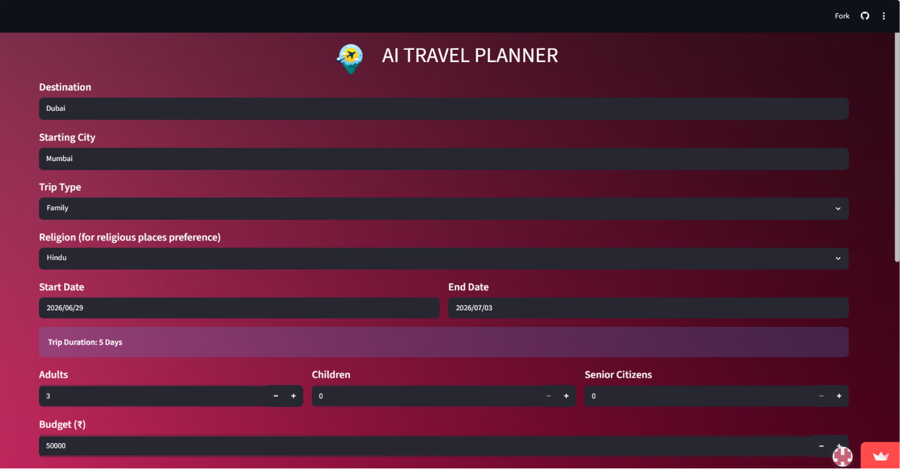
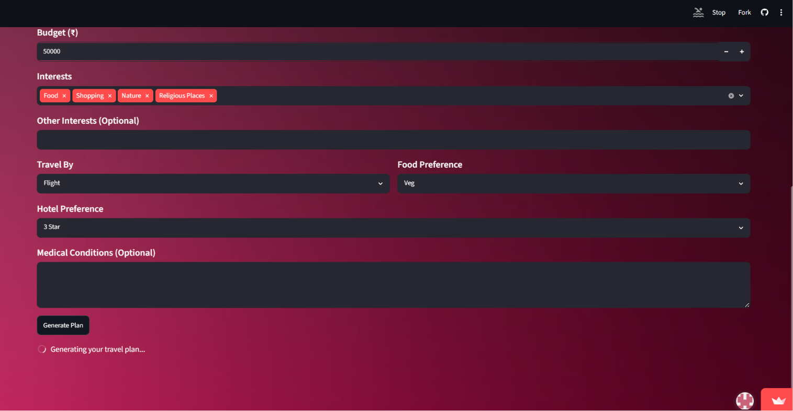

# AI Travel Planner

**Live Demo:** https://aicte-batch1-ai-travel-planner-hgn8qy6tvlcmimusp2jzpn.streamlit.app <br>
An AI-powered travel planner built with **Streamlit** and **Google Gemini AI** that generates personalized travel itineraries based on user preferences like budget, destination, travel dates, interests, and transport mode.

## Problem Statement
Planning a trip manually involves multiple decisions like budget, transport, hotels, and daily itinerary, which can be time-consuming and confusing.

## Solution
This application uses **Google Gemini AI** to generate a complete, personalized travel plan including itinerary, budget breakdown, travel options, hotel suggestions, and safety tips.

## Features
* Personalized AI-generated travel itinerary
* Day-wise trip planning (Morning / Afternoon / Evening)
* Budget estimation and breakdown
* Travel mode suggestions (Flight, Train, Bus, Car)
* Hotel recommendations based on preference
* Food and local experience suggestions
* Weather-based travel guidance
* Safety and travel tips
* PDF download of travel plan

## Tech Stack
* Python
* Streamlit
* Google Gemini API
* FPDF
* python-dotenv

## Screenshots

### Home Page




### Download Pdf 


## Installation & Setup

### 1. Install dependencies

```bash id="install1"
pip install -r requirements.txt
```
### 2. Set up API Key

Create a file:

```text id="secret1"
.streamlit/secrets.toml
```

Add:

```toml id="secret2"
GEMINI_API_KEY = "your_api_key_here"
```

Get API key from Google AI Studio.

### 3. Run the application

```bash id="run1"
streamlit run app.py
```

##  Requirements

```text id="req1"
streamlit
google-generativeai
python-dotenv
fpdf
```

## Future Improvements

* Real-time weather API integration
* Live flight and hotel price tracking
* Google Maps integration
* User login and saved trips
* Expense tracker for trips

## Author
Disha Mistry
